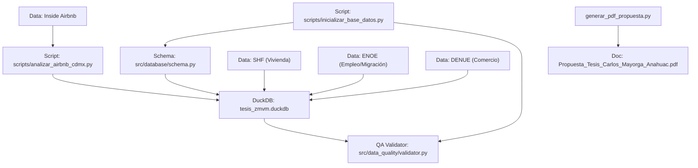

# 📊 Modelación de Factores Dinámicos y Cointegración (FAVAR-VECM) para el Pronóstico de la Presión Inmobiliaria y el Desplazamiento Demográfico en la ZMVM

[](https://www.python.org/)
[](https://docs.conda.io/)
[](https://duckdb.org/)
[](LICENSE)
[](heartbeat.md)

**Protocolo de Tesis para la Maestría en Estadística**  
**Universidad Anáhuac México Norte — Facultad de Ciencias Actuariales**

* **Autor:** Carlos Guillermo Mayorga Tapia ([@cmayorgat44](https://github.com/cmayorgat44))
* **Asesor:** Dr. José Eluid Silva Urrutia
* **Contacto:** `mayorgacg@gmail.com`
* **Cobertura Geográfica:** Zona Metropolitana del Valle de México (ZMVM) — 19 alcaldías y municipios clave.
* **Periodo de Análisis:** 2005Q1 – 2024Q4 (80 trimestres continuos).

---

## 📄 Documentos Principales del Protocolo
- 📄 **Documento de Tesis (PDF Oficial):** [Propuesta_Tesis_Carlos_Mayorga_Anahuac.pdf](Propuesta_Tesis_Carlos_Mayorga_Anahuac.pdf)
- 📝 **Protocolo Markdown Completo:** [propuesta_tesis_carlos_mayorga.md](https://github.com/cmayorgat44/seminario_investigacion/blob/main/propuesta_tesis_carlos_mayorga.md) *(v2.0)*
- 💓 **Monitor de Estatus del Proyecto:** [heartbeat.md](heartbeat.md)
- 🕸️ **Grafo de Arquitectura (Graphify):** [docs/architecture_graph.md](docs/architecture_graph.md)

---

## 📌 Resumen Ejecutivo

La Zona Metropolitana del Valle de México (ZMVM), con más de 21 millones de habitantes, vive una acelerada reestructuración urbana caracterizada por la apreciación del suelo, la gentrificación comercial y la expansión del alojamiento vacacional de corta estancia (plataformas digitales como Airbnb).

Las proyecciones demográficas tradicionales en México —lideradas por el Consejo Nacional de Población (CONAPO)— utilizan el **Método de Componentes Demográficos (MCD)** en horizontes decenales a escala estatal o nacional. Aunque el MCD es el estándar oficial para la planeación gubernamental, opera bajo un marco **determinista** incapaz de capturar choques socioeconómicos urbanos de alta frecuencia (trimestrales) y la incertidumbre estocástica asociada a la movilidad laboral y el desplazamiento poblacional secundario.

Este proyecto propone abordar el desplazamiento demográfico urbano mediante un modelo de **Series de Tiempo de Alta Dimensión** basado en **Factores Dinámicos Aumentados en Vectores Autorregresivos con Corrección de Error (FAVAR-VECM)**. El objetivo central es integrar indicadores inmobiliarios (SHF), actividad comercial (DENUE), alojamiento vacacional (Airbnb) y microdatos de empleo y migración (ENOE) para cuantificar la velocidad de transmisión de los choques inmobiliarios y predecir el desplazamiento a un horizonte de 3 a 5 años (12–20 trimestres).

---

## 🔬 Fundamentación Teórica y Literatura Académica

La propuesta se sustenta en tres vertientes de la literatura econométrica y espacial contemporánea:

1. **Modelos de Factores Dinámicos y FAVAR en Entornos Ricos en Datos:**
   * **Stock, J. H., & Watson, M. W. (2002, 2016):** Fundamentos de pronóstico macroeconómico con componentes principales en entornos de alta dimensión ($p \gg n$).
   * **Bernanke, B. S., Boivin, J., & Eliasz, P. (2005):** Introducción del marco FAVAR (*Factor-Augmented VAR*), demostrando cómo incluir información latente en sistemas autorregresivos sin agotar grados de libertad.
2. **Econometría Urbana, Vivienda y Migración Cointegrada:**
   * **Saiz, A. (2007):** Evidencia empírica sobre choques de demanda habitacional, incrementos de renta y reacomodo de la población residente.
   * **Engsted, T., & Bentzen, J. (1997):** Cointegración multivariada para estimar relaciones de equilibrio a largo plazo entre migración interna e indicadores de vivienda.
   * **Guerrieri, V., Hartley, D., & Hurst, E. (2013):** Modelación de la *gentrificación endógena* y ondas de apreciación inmobiliaria a escala de vecindario.
3. **Inferencia Causal y Alojamiento Temporal de Corta Estancia:**
   * **Barron, K., Kung, E., & Proserpio, D. (2021):** Impacto de las plataformas de hospedaje compartido (Airbnb) sobre el encarecimiento de rentas residenciales y sustitución habitacional.
   * **Hyndman, R. J., & Ullah, M. S. (2007):** Estándar moderno en series de tiempo demográficas y datos funcionales.

---

## 🧮 Formulación Matemática del Modelo FAVAR-VECM

Sea $X_t$ un vector de dimensión $N \times 1$ que contiene $N$ series de tiempo socioeconómicas e inmobiliarias observadas en la ZMVM en el trimestre $t = 1, \dots, T$, donde $N$ representa la alta dimensión del panel urbano.

### 1. Modelo de Factores Dinámicos (DFM)
Descomponemos $X_t$ en $K \ll N$ factores latentes $F_t$ ($K \times 1$) y un término idiosincrásico $e_t$:
$$X_t = \Lambda F_t + e_t , \quad e_t \sim \mathcal{N}(0, \Omega)$$
donde $\Lambda$ es la matriz de cargas factoriales ($N \times K$). Los factores $\hat{F}_t$ capturan la *Presión Inmobiliaria* y la *Gentrificación Comercial*.

### 2. Sistema FAVAR-VECM Cointegrado
Sea $Y_t$ el vector de variables observadas clave (saldo migratorio neto e ingreso real por hora de la ENOE). Construimos el vector aumentado $W_t = [\hat{F}_t', Y_t']'$. 

Si las componentes de $W_t$ son $I(1)$ y están cointegradas con rango $r > 0$, el sistema se especifica en su forma de Modelo de Corrección de Error Vectorial (VECM):

$$\Delta W_t = \Pi W_{t-1} + \sum_{i=1}^{p-1} \Gamma_i \Delta W_{t-i} + \varepsilon_t , \quad \varepsilon_t \sim \text{WN}(0, \Sigma)$$

donde:
* $\Pi = \alpha \beta'$ es la matriz de rango $r$, con $\beta$ representando los vectores de cointegración de largo plazo y $\alpha$ las velocidades de ajuste.
* $\Gamma_i$ gobierna la dinámica estocástica de corto plazo.
* Se estiman las **Funciones de Impulso-Respuesta (IRF)** y la **Descomposición de la Varianza del Error de Pronóstico (FEVD)**.

---

## 🌐 Fuentes de Datos Abiertos

| Fuente de Datos | Institución | Frecuencia | Periodo | Rol en el Modelo |
| :--- | :--- | :--- | :--- | :--- |
| **Índice SHF de Vivienda** | Sociedad Hipotecaria Federal | Trimestral | 2005 – 2024 (80 obs.) | Precios e índice de vivienda media/residencial. |
| **ENOE** | INEGI | Trimestral | 2005 – 2024 | Microdatos de movilidad reciente, salarios e informalidad. |
| **DENUE** | INEGI | Semestral / Anual | 2010 – 2024 | Conteo y densidad de comercios gentrificadores (SCIAN). |
| **Inside Airbnb CDMX** | Inside Airbnb | Mensual / Trimestral | 2015 – 2024 | Propiedades activas, tipología, precios por noche y RevPAR. |

---

## 📈 Hallazgos Empíricos Preliminares (Inside Airbnb CDMX)

Tras la descarga e inspección del universo de **31,430 propiedades activas** en la Ciudad de México (`raw_data/airbnb_cdmx_summary.csv`), se confirmaron dos patrones empíricos fundamentales:

1. **Hiper-concentración Espacial:** Cuatro alcaldías centrales concentran **más del 80% de toda la oferta vacacional** de la Ciudad de México:
   * **Cuauhtémoc:** 14,449 propiedades (**45.97%** del total de la ciudad) | Mediana: **$1,979.00 MXN/noche**.
   * **Miguel Hidalgo:** 4,870 propiedades (**15.49%**) | Mediana: **$2,211.50 MXN/noche**.
   * **Benito Juárez:** 3,623 propiedades (**11.53%**) | Mediana: **$1,398.00 MXN/noche**.
   * **Coyoacán:** 2,458 propiedades (**7.82%**) | Mediana: **$1,598.00 MXN/noche**.
2. **Sustitución de Parque Habitacional:** El **66.82% (21,000 departamentos/casas completas)** son unidades extraídas del mercado residencial permanente para uso turístico comercial.

---

## 🏗️ Arquitectura de Software y Datos (DuckDB 3NF)

El proyecto implementa las mejores prácticas de ingeniería de datos y desarrollo modular en Python:

```
seminario_investigacion/
├── raw_data/                       # Datos crudos (ignorados en git masivos)
│   └── airbnb_cdmx_summary.csv
├── processed_data/                 # Base de datos relacional y salidas procesadas
│   ├── tesis_zmvm.duckdb           # Base de datos DuckDB analítica local (3NF / Esquema Estrella)
│   └── resumen_airbnb_por_alcaldia.csv
├── src/                            # Módulos del paquete principal
│   ├── database/
│   │   └── schema.py               # Definición de tablas relacionales y vistas SQL en DuckDB
│   └── data_quality/
│       └── validator.py            # Suite de pruebas de calidad, outliers MAD e integrabilidad I(d)
├── scripts/                        # Scripts ejecutables de automatización
│   ├── inicializar_base_datos.py   # Creación de la BD DuckDB y pruebas de QA
│   ├── analizar_airbnb_cdmx.py     # Análisis exploratorio del dataset de Airbnb
│   ├── diagnosticar_fuentes_datos.py # Test de endpoints de datos abiertos
│   └── generar_grafo_proyecto.py   # Generador del grafo de arquitectura (Graphify)
├── docs/                           # Documentación y diagramas
│   └── architecture_graph.md       # Diagrama visual de arquitectura en Mermaid
├── environment.yml                 # Entorno conda reproducible
├── generar_pdf_propuesta.py        # Generador de PDF institucional en ReportLab
├── Propuesta_Tesis_Carlos_Mayorga_Anahuac.pdf # Entregable oficial en PDF
├── heartbeat.md                    # Monitor de salud y avance del proyecto
└── README.md                       # Documentación principal del repositorio
```

### Modelo Relacional DuckDB
* **`dim_alcaldia`:** Catálogo de 19 alcaldías y municipios de la ZMVM.
* **`dim_tiempo`:** Registro estricto de 80 trimestres ($2005\text{Q}1 \dots 2024\text{Q}4$).
* **`fact_shf_precios`**, **`fact_airbnb_metricas`**, **`fact_enoe_movilidad`**, **`fact_denue_comercio`**.
* **`vista_panel_multivariado`:** Vista unificada de consulta directa.

---

## 🛡️ Pruebas de Robustez Estadística (Data QA Suite)

El módulo [`src/data_quality/validator.py`](src/data_quality/validator.py) ejecuta automáticamente:
1. **Continuidad Temporal Estricta:** Verificación de 80 trimestres continuos sin saltos.
2. **Detección Robusta de Atípicos (MAD):** Desviación Absoluta de la Mediana para evitar sesgos de desviaciones estándar cuadráticas.
3. **Integrabilidad Estocástica $I(d)$:** Pruebas cruzadas de raíz unitaria **Augmented Dickey-Fuller (ADF)** y **KPSS** para determinar si las series requieren primera diferencia.

---

## 🕸️ Grafo de Arquitectura (Graphify)

El flujo de información y dependencias del código se representa dinámicamente mediante la suite `graphifyy` / `NetworkX`:



---

## ⚡ Guía de Instalación y Reproducción

### 1. Clonar el Repositorio
```bash
git clone git@personal.github.com:cmayorgat44/seminario_investigacion.git
cd seminario_investigacion
```

### 2. Crear y Activar el Ambiente de Conda
```bash
conda env create -f environment.yml
conda activate tesis_estadistica
```

### 3. Inicializar la Base de Datos DuckDB y Ejecutar Pruebas QA
```bash
python scripts/inicializar_base_datos.py
```

### 4. Generar el Grafo de Arquitectura y el PDF del Protocolo
```bash
python scripts/generar_grafo_proyecto.py
python generar_pdf_propuesta.py
```

---

## 📅 Cronograma de Investigación (12 Meses)

```text
[Meses 1 - 2]  : Extracción, limpieza y unificación de series a malla trimestral.
[Meses 3 - 4]  : Pruebas de integrabilidad I(d) y estimación del Modelo de Factores Dinámicos (DFM).
[Meses 5 - 6]  : Pruebas de Cointegración de Johansen y especificación FAVAR-VECM.
[Meses 7 - 8]  : Inferencia dinámica: Funciones de Impulso-Respuesta (IRF) y FEVD.
[Meses 9 - 10] : Validación fuera de muestra (Backtesting 2021-2024) contra modelos ARIMA/VAR.
[Meses 11 - 12]: Redacción final de tesis, artículo científico y defensa formal.
```

---

## 📜 Licencia y Contacto

Este proyecto está bajo la Licencia **MIT** — consulta el archivo `LICENSE` para más detalles.

* **Autor:** Carlos Guillermo Mayorga Tapia  
* **Institución:** Universidad Anáhuac México Norte — Maestría en Estadística  
* **Asesor:** Dr. José Eluid Silva Urrutia  
* **Contacto:** `mayorgacg@gmail.com`
