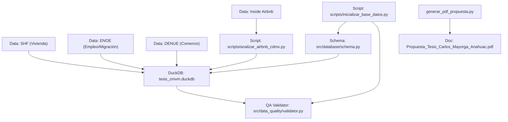

# 🕸️ Grafo de Arquitectura del Proyecto (Graphify)
## Maestría en Estadística — Universidad Anáhuac México Norte

Este documento mapea las relaciones de dependencia entre fuentes de datos, módulos de código, base de datos analítica y salidas del proyecto.

### Diagrama de Grafo de Flujo

### Resumen de Nodos de la Arquitectura
* **Fuentes de Datos (Sources):** SHF, ENOE, DENUE, Inside Airbnb CDMX.
* **Capa de Almacenamiento:** DuckDB (`processed_data/tesis_zmvm.duckdb`).
* **Módulos de Código:** `src/database/schema.py`, `src/data_quality/validator.py`.
* **Entregables Principales:** `Propuesta_Tesis_Carlos_Mayorga_Anahuac.pdf`, `heartbeat.md`.
