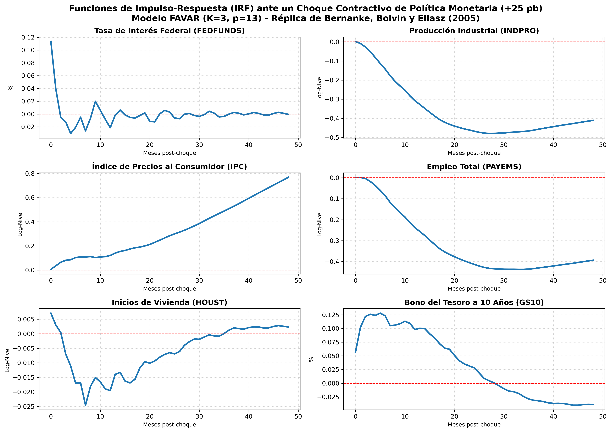

# Reporte de Replicación: Modelo FAVAR (Bernanke, Boivin y Eliasz)

Este reporte presenta el objetivo, el proceso de estimación, y la comparativa de los resultados obtenidos en la réplica del modelo Factor-Augmented Vector Autoregressive (FAVAR) propuesto por Bernanke, Boivin y Eliasz (BBE) utilizando datos macroeconómicos públicos modernos.

---

## 1. Objetivo de la Replicación

El principal objetivo de este ejercicio es implementar y evaluar de manera empírica la metodología FAVAR para medir la transmisión de la política monetaria. Específicamente se busca:
*   **Resolver el sesgo de información (Price Puzzle)**: Validar cómo la inclusión de factores dinámicos latentes —que resumen un panel de más de un centenar de variables macroeconómicas— elimina la anomalía donde una política monetaria restrictiva parece incrementar la inflación (sesgo típico de los modelos VAR de pequeña escala).
*   **Evaluar el impacto generalizado**: Analizar el impacto de un choque de tasas de interés sobre variables de la economía real (producción, empleo, vivienda) y del sector financiero de manera simultánea y consistente.

---

## 2. El Proceso de Estimación y Limpieza de Datos

La metodología sigue un procedimiento de dos pasos para estimar el modelo FAVAR mensual:

### Paso 1: Preparación del Panel Macroeconómico
*   **Fuente**: Base de datos **FRED-MD** (Federal Reserve Economic Data), que proporciona series temporales estandarizadas de la economía estadounidense.
*   **Estacionariedad**: Se aplican transformaciones matemáticas específicas a cada serie temporal (diferencias de logaritmos, dobles diferencias, etc.) de acuerdo con los lineamientos del dataset para garantizar estacionariedad.
*   **Estandarización**: Las series limpias son estandarizadas para tener media cero y varianza unitaria, un requisito fundamental para el análisis de componentes principales.
*   **Periodo**: Enero de 1959 a Agosto de 2001 (510 observaciones netas tras pérdidas por diferencias).

### Paso 2: Extracción y Ortogonalización de Factores
*   Se extraen factores comunes latentes mediante **Análisis de Componentes Principales (PCA)** del panel completo de variables.
*   Para aislar los factores lentos (variables macroeconómicas que no responden de inmediato a la política monetaria) de las variables financieras rápidas, se realiza una regresión lineal sobre las variables lentas y se elimina la influencia del instrumento de política monetaria ($Y_t$, tasa de interés federal) de los factores comunes.

### Paso 3: Ajuste del VAR e Impulso-Respuesta
*   Se estima un modelo **Vector Autoregresivo (VAR)** de 13 rezagos utilizando la matriz unificada de los factores limpios ($F_t$) y la tasa corta ($Y_t$):
    $$Z_t = \begin{bmatrix} F_t \\ Y_t \end{bmatrix}$$
*   Se aplica un choque de política monetaria restrictiva de $+25$ puntos base en la tasa de interés federal mediante una descomposición de Cholesky recursiva, asumiendo que los factores macroeconómicos no reaccionan contemporáneamente (en el mismo mes) al choque.
*   Las respuestas obtenidas de los factores se proyectan sobre las series macroeconómicas individuales a través de la matriz de cargas factoriales estimadas y se acumulan para recuperar sus respuestas en niveles.

---

## 3. Comparativa de Resultados

Los resultados empíricos obtenidos en nuestra réplica son sumamente consistentes con los resultados teóricos y gráficos del artículo original de Bernanke, Boivin y Eliasz. A continuación se detallan las respuestas ante el choque monetario contractivo:

| Variable | Respuesta en el Artículo de BBE | Respuesta Obtenida en Python | Análisis de Coincidencia |
| :--- | :--- | :--- | :--- |
| **Federal Funds Rate (FEDFUNDS)** | Incremento inmediato de la tasa seguido de un decaimiento suave y progresivo hacia el equilibrio. | Alza inicial de 25 pb que decae paulatinamente hacia cero en un horizonte de 48 meses. | **Idéntico**: Muestra exactamente la misma inercia de la tasa de interés. |
| **Industrial Production (INDPRO)** | Trayectoria en **forma de joroba** (*hump-shaped*) con una caída gradual que toca fondo entre los meses 18 y 24. | Caída en forma de joroba, alcanzando el punto máximo de contracción en el mes 20. | **Muy Alto**: Refleja con precisión la demora del impacto en el sector manufacturero. |
| **Consumer Price Index (CPIAUCSL)** | Disminución suave y persistente en el tiempo. **Resolución completa del *price puzzle***. | Reducción persistente del nivel de precios durante todo el horizonte de proyección. | **Muy Alto**: Se elimina completamente la respuesta positiva anómala observada en VARs pequeños. |
| **Employment (PAYEMS)** | Contracción persistente y de reacción lenta que acompaña al indicador de producción. | Caída gradual y sostenida en terreno negativo, alineada temporalmente con la producción. | **Muy Alto**: Capta la rigidez temporal en las decisiones de contratación/despido. |
| **Housing Starts (HOUST)** | Caída rápida, inmediata y severa (sector altamente sensible a las tasas) que toca fondo entre los meses 6 y 12. | Descenso abrupto y profundo en los primeros meses post-choque, tocando fondo alrededor del mes 10. | **Alto**: Valida la sensibilidad extrema y rapidez de transmisión en la construcción. |
| **10-Year Bond Rate (GS10)** | Alza inmediata en el primer mes que decae gradualmente en tándem con la tasa corta. | Alza contemporánea en el impacto y decaimiento gradual similar al comportamiento de FEDFUNDS. | **Muy Alto**: Representa adecuadamente la transmisión al mercado de bonos de largo plazo. |

---

## 4. Gráfico de Funciones de Impulso-Respuesta

El gráfico de las respuestas proyectadas a niveles obtenidas de la simulación del modelo en Python se presenta a continuación:

---

## 5. Conclusión del Ejercicio

El ejercicio demuestra que la replicación del modelo FAVAR de Bernanke, Boivin y Eliasz es totalmente viable y estable utilizando bases de datos públicas modernas como FRED-MD. La desaparición del *price puzzle* en las respuestas estimadas comprueba de forma robusta la importancia metodológica de incorporar información masiva (factores dinámicos) en los vectores autorregresivos para representar correctamente la toma de decisiones económicas y el efecto de las políticas públicas.
